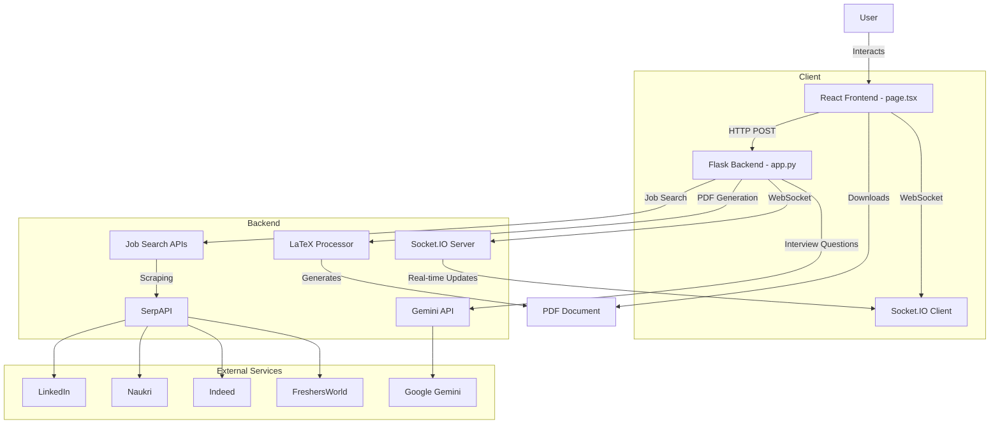

# SymbiosisCareer

SymbiosisCareer is an AI-powered job search and interview preparation platform designed specifically for 4th-year students and fresh graduates of Symbiosis Institute of Technology, Pune. The application helps users find AI/ML job opportunities in India and provides tailored, India-specific interview questions with solutions for various technical domains. Built with a modern tech stack, it offers a seamless user experience with real-time updates and professional PDF generation for interview preparation materials.

## Features

- **Job Search**:
  - Search for AI/ML job opportunities across multiple platforms (LinkedIn, Naukri, Indeed, FreshersWorld).
  - Filter jobs by role, location, experience level, job type, and salary range.
  - Save favorite jobs for later reference.
  - Real-time search progress updates via WebSocket.
- **Interview Question Search**:
  - Retrieve India-specific interview questions for domains like NLP, Computer Vision, Machine Learning, etc.
  - Optionally filter by company for targeted preparation.
  - Generate and download professionally formatted PDFs with questions and solutions.
- **User Interface**:
  - Sleek, modern UI built with React, Next.js, and Tailwind CSS.
  - Animated components using Framer Motion for an engaging experience.
  - Mobile-style AI processing log display for real-time updates.
- **Backend**:
  - Flask-based backend with WebSocket support for real-time communication.
  - Integration with SerpAPI for job scraping and Gemini API for interview question generation.
  - LaTeX-based PDF generation for interview question documents.

## Architecture

The SymbiosisCareer application follows a client-server architecture with a React frontend, Flask backend, and external API integrations. Below is a Mermaid diagram illustrating the architecture:



### Architecture Explanation
- **React Frontend (page.tsx)**: Handles user interactions, displays job listings and interview questions, and communicates with the backend via HTTP and WebSocket.
- **Flask Backend (app.py)**: Processes job and interview question searches, integrates with external APIs, and generates PDFs using LaTeX.
- **Socket.IO**: Enables real-time communication for search progress updates and AI processing logs.
- **SerpAPI**: Scrapes job listings from LinkedIn, Naukri, Indeed, and FreshersWorld.
- **Gemini API**: Generates tailored interview questions and solutions based on user-specified domains and companies.
- **LaTeX Processor**: Creates formatted PDF documents for interview question results.

## Installation

### Prerequisites
- Node.js (v18 or higher)
- Python (v3.8 or higher)
- LaTeX distribution (e.g., TeX Live for PDF generation)
- API keys for:
  - SerpAPI (`SERPAPI_API_KEY`)
  - Google Gemini (`GEMINI_API_KEY`)

### Steps
1. **Clone the Repository**:
   ```bash
   git clone https://github.com/yourusername/SymbiosisCareer.git
   cd SymbiosisCareer
   ```

2. **Frontend Setup**:
   ```bash
   cd frontend
   npm install
   ```

3. **Backend Setup**:
   ```bash
   cd backend
   python -m venv venv
   source venv/bin/activate  # On Windows: venv\Scripts\activate
   pip install -r requirements.txt
   ```

4. **Set Environment Variables**:
   Create a `.env` file in the backend directory:
   ```env
   SERPAPI_API_KEY=your_serpapi_key
   GEMINI_API_KEY=your_gemini_api_key
   ```

5. **Install LaTeX**:
   - On Ubuntu: `sudo apt-get install texlive-full texlive-fonts-extra`
   - On macOS: Install MacTeX (`brew install mactex`)
   - On Windows: Install MiKTeX or TeX Live

## Usage

1. **Run the Backend**:
   ```bash
   cd backend
   source venv/bin/activate  # On Windows: venv\Scripts\activate
   python app.py
   ```

2. **Run the Frontend**:
   ```bash
   cd frontend
   npm run dev
   ```

3. **Access the Application**:
   Open `http://localhost:3000` in your browser.

4. **Job Search**:
   - Select the "Job Search" tab.
   - Enter a job role (e.g., "AI Engineer") and location (e.g., "Pune").
   - Apply filters (experience level, job type, salary range) if desired.
   - Click "Start Search" to view results.
   - Save jobs by clicking the bookmark icon.

5. **Interview Question Search**:
   - Select the "Interview Questions" tab.
   - Choose a domain (e.g., "NLP") and optionally specify a company (e.g., "TCS").
   - Click "Find Questions" to retrieve questions and solutions.
   - Download the results as a PDF using the "Download PDF" button.

## Requirements

Create a `requirements.txt` file in the backend directory with the following:

```text
flask==2.3.3
flask-cors==4.0.1
flask-socketio==5.3.6
requests==2.31.0
serpapi==0.1.5
python-socketio==5.11.2
reportlab==4.0.7
```

## Contributing

1. Fork the repository.
2. Create a new branch (`git checkout -b feature/your-feature`).
3. Commit your changes (`git commit -m "Add your feature"`).
4. Push to the branch (`git push origin feature/your-feature`).
5. Open a pull request.

## License

This project is licensed under the MIT License.